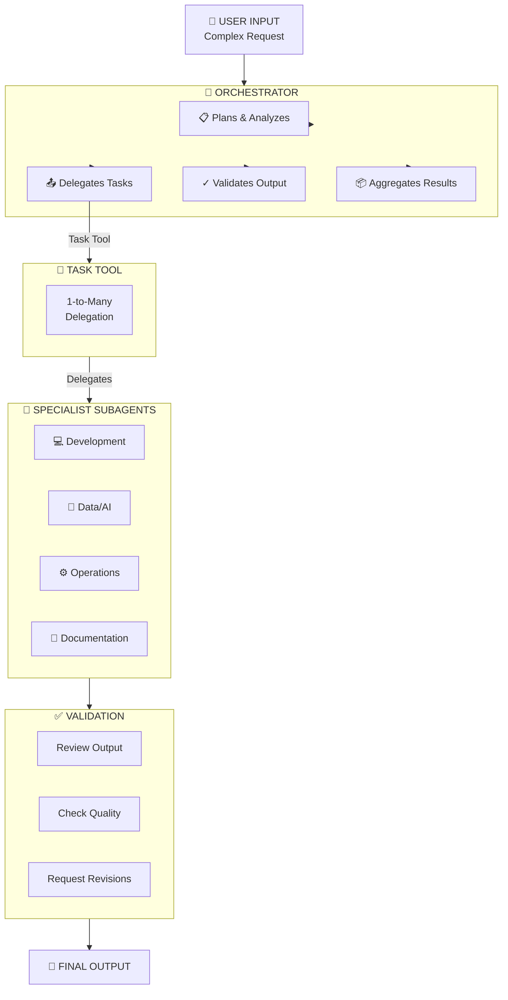
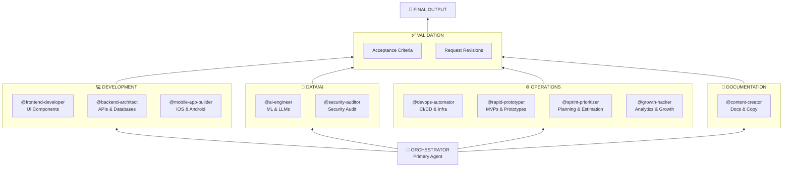
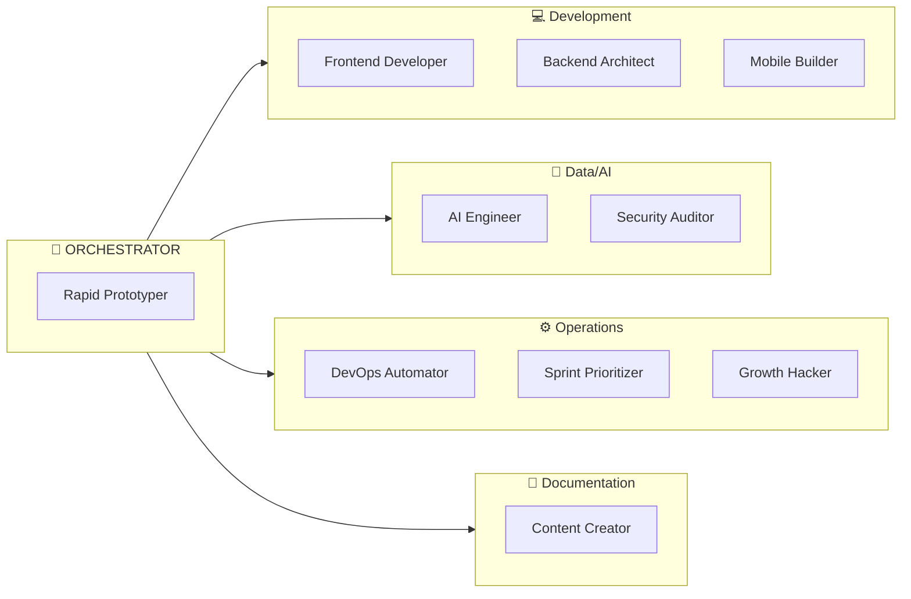

# OpenCode Orchestrator System

<div align="center">

[](https://github.com/bc100000000000/orchestrator-opencode/stargazers)
[](https://github.com/bc100000000000/orchestrator-opencode/network)
[](https://github.com/bc100000000000/orchestrator-opencode/blob/main/LICENSE)
[](https://github.com/bc100000000000/orchestrator-opencode/issues)

A comprehensive multi-agent orchestration system for [OpenCode](https://opencode.ai) that coordinates specialized AI agents for complex software development tasks.


</div>

---

## Architecture Overview



---

## Agent Tree (Merkle-Style)



---

## Agent Categories



---

## Quick Agent Reference

| Category | Agent | Expertise |
|:--------:|-------|-----------|
| 💻 | **@frontend-developer** | UI Components, React, Vue, Accessibility |
| 💻 | **@backend-architect** | APIs, Databases, System Design |
| 💻 | **@mobile-app-builder** | iOS, Android, React Native, Flutter |
| 🧠 | **@ai-engineer** | ML Models, LLMs, Prompt Engineering |
| 🧠 | **@security-auditor** | Security Auditing, Vulnerability Assessment |
| ⚙️ | **@devops-automator** | CI/CD, Infrastructure, Deployment |
| ⚙️ | **@rapid-prototyper** | MVPs, Proof-of-Concepts |
| ⚙️ | **@sprint-prioritizer** | Planning, Estimation, Sprints |
| ⚙️ | **@growth-hacker** | Analytics, A/B Testing, Growth |
| 📝 | **@content-creator** | Documentation, Marketing Copy |

---

## Features

<div align="center">

| Feature | Description |
|:-------:|-------------|
| 🤖 | **11 Specialized Agents** - Frontend, backend, mobile, AI, DevOps, security |
| 📋 | **Consult vs Delegate** - Get advice or get implementations |
| 🎯 | **User-in-the-Loop** - Approval gates at decision points |
| 🔐 | **Granular Permissions** - Specialists ask before editing |
| ⚡ | **Auto-Execution** - Automatically proceeds within approved plans |
| 🛡️ | **Smart Pause Points** - Stops at decisions, scope changes |

</div>

---

## How It Works

### 1. Analysis
Orchestrator analyzes your request and identifies required specialists.

### 2. Planning
Orchestrator presents an execution plan with CONSULT/DELEGATE steps:

```
## Execution Plan

**Request**: Build a REST API for user authentication

**Steps**:
1. [CONSULT] @backend-architect: Review auth strategy
2. [DELEGATE] @backend-architect: Design API schema
3. [DELEGATE] @backend-architect: Implement endpoints

**Pause Points**:
- After Step 1: Decision on authentication strategy

**Approve?** [Yes / Modify / Cancel]
```

### 3. Execution
- Orchestrator auto-executes approved steps
- Pauses at decision boundaries
- Pauses before destructive operations
- Aggregates results from all specialists

---

## Consult vs Delegate

### CONSULT Mode
Specialist provides **read-only advice**:
```
[CONSULT] @backend-architect: Best auth strategy for REST API?
```

### DELEGATE Mode
Specialist **implements** the task:
```
[DELEGATE] @backend-architect: Implement JWT auth endpoints
```

---

## Installation

```bash
# Clone the repository
git clone https://github.com/bc100000000000/orchestrator-opencode.git
cd orchestrator-opencode

# Copy agents to OpenCode
cp -r .opencode/agents ~/.config/opencode/
cp -r .opencode/plugins ~/.config/opencode/
```

### Usage

```bash
# Start OpenCode
opencode

# Switch to Orchestrator (press Tab)
# Give a complex task
> Build a REST API for user authentication with JWT tokens
```

---

## Examples

| Task | Command |
|------|---------|
| Full-Stack App | `> Build a todo app with React and Express` |
| Mobile App | `> Create a habit tracking iOS app with SwiftUI` |
| Infrastructure | `> Design CI/CD pipeline with monitoring` |
| Security Audit | `> @security-auditor Audit this codebase` |
| Quick Prototype | `> @rapid-prototyper Build a demo landing page` |

---

## Project Structure

```
orchestrator-opencode/
├── .opencode/
│   ├── agents/
│   │   ├── orchestrator.md         # Primary agent
│   │   ├── frontend-developer.md   # Subagent
│   │   ├── backend-architect.md    # Subagent
│   │   ├── mobile-app-builder.md   # Subagent
│   │   ├── ai-engineer.md          # Subagent
│   │   ├── devops-automator.md     # Subagent
│   │   ├── rapid-prototyper.md     # Subagent
│   │   ├── sprint-prioritizer.md   # Subagent
│   │   ├── growth-hacker.md        # Subagent
│   │   ├── security-auditor.md     # Subagent
│   │   └── content-creator.md      # Subagent
│   └── plugins/
│       └── orchestrator.ts         # Validator plugin
├── README.md
├── LICENSE
├── CONTRIBUTING.md
└── package.json
```

---

## Contributing

Contributions are welcome! Please see [CONTRIBUTING.md](CONTRIBUTING.md).

### Add New Agents

1. Create `.opencode/agents/your-agent.md`
2. Define mode, permissions, and prompt
3. Submit a PR

---

## License

MIT License - see [LICENSE](LICENSE).

---

## Acknowledgments

- [OpenCode](https://opencode.ai) - The AI coding agent platform
- [OpenAgentsControl](https://github.com/darrenhinde/OpenAgentsControl) - Multi-agent inspiration

---

<div align="center">

### ⭐ Star this repo if you find it useful!

**Built for developers who want intelligent coordination of specialized AI agents.**

</div>
